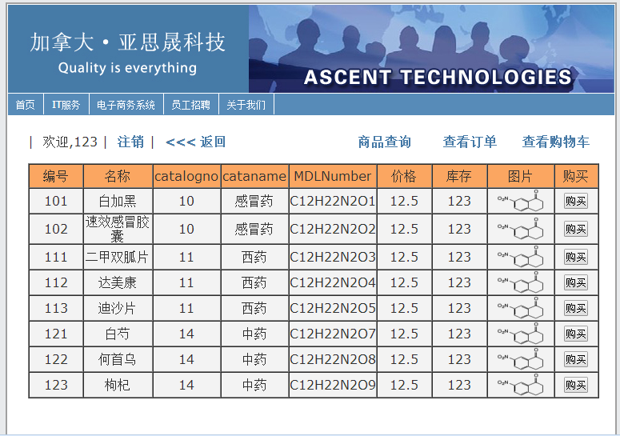

# JavaWeb项目·亚思晟医药商务系统
**javabean+jsp+servlet**


-----------------------------------------------------------
## 项目介绍
	此项目为个人大三javaweb课程设计。
	设计一个“艾斯医药商务系统”，完成系统管理和完整的购物过程。
    艾斯医药项目功能可以分为三个部分，一是系统管理模块，二是注册用户管理模块，三是游客管理模块，而他们各自又又具体的小模块构成。

### 需要用到
	- MySQL 数据库
	- Tomcat 服务器
	-  eclipse【若只是部署war文件则可以不使用】
	-  java环境

### 模块图


### 部分模块
    - 登录模块：
     					 实现用户登录、用户注册、用户退出等功能，并且保证用户信息存入后台数据库，实现用户登录验证，包括错误提醒等。
	- 商品浏览：
     					浏览商品信息，实现商品详细信息浏览，包括名称、编号、归类、化学方程式、价格、库存、图片及购买链接等。
	- 商品查询：
						查询已经登记的商品呢，根据多种条件来查询，比如名称，摘要、MDL Number、药品化学方程式等特征信息。包含关键字的商品都能查到。
	- 购物：
						实现完整购物过程，包括购物车管理以及订单管理，订单提交，订单的增加、删除、修改等，模拟完整的购物过程。
	- 后台管理：
						包括订单管理、用户管理、商品管理、邮件管理等，实现订单、商品、用户的增删改查、实现不同用户的权限权利和分配，实现邮件提醒和管理，以及后台数据库的连接和							正确保存。


----------
## 搭建环境 
     MySQL + Tomcat + [ eclipse]

## 使用
	注意： 首先你需要对tomcat 进行配置 
*找到你的tomcat文件夹下conf文件夹下的context.xml  在 Context标签内 添加如下内容：*

```xml
<Resource
	name="jdbc/mysql"
	type="javax.sql.DataSource"
	driverClassName="com.mysql.jdbc.Driver"
	password="1234"
	maxIdle="20"
	maxWait="100"
	username="root"
	url="jdbc:mysql://localhost:3306/ascentweb?useUnicode&amp;characterEncoding=UTF-8"
	maxActive="20"></Resource>
```	

*数据库相关配置改成你自己的 password、username、url【数据库名称】*

### 在eclipse上打开

**1. git clone https://github.com/maxinehehe/AscentWeb.git** <br />
**2. 打开克隆的文件，找到AscentWebDataBase，在你的数据库中运行: source 路径名/ascentweb_mysql.sql** <br />
   **trig.sql 为触发器语句 运行方法同上** <br />
**3.使用eclipse导入即可** <br />
**4.将项目部署到tomcat上** <br />


----------


### 将war文件部署到tomcat上打开

*如果无法进入配置页面，在tomcat/conf/tomcat-users.xml中添加：*
```xml
 <role rolename="manager-gui"/>
    <role rolename="admin-gui"/>
    <user username="admin" password="123456" roles="manager-gui,admin-gui"/>
```
**A. windows打开运行\bin  找到start.dat双击即可运行  Linux下./start.sh运行** <br />
**B. 将war项目部署到tomcat上，重启tomcat，输入网址即可。** <br />

# 项目部分截图
## 电子商务页面


## 注册页面


## 注册成功页面


## 登录失败页面


## 商品浏览页面


## 邮件接收


## 管理员浏览商品


## 管理员浏览用户


  
  [2]: ./images/%E5%9B%BE%E7%89%872.png "图片2.png"
  [3]: ./images/%E5%9B%BE%E7%89%873.png "图片3.png"
  [4]: ./images/%E5%9B%BE%E7%89%874.png "图片4.png"
  [5]: ./images/1483619055797.jpg "1483619055797.jpg"
  [6]: ./images/%E5%9B%BE%E7%89%876.png "图片6.png"
  [7]: ./images/%E5%9B%BE%E7%89%877.png "图片7.png"
  [8]: ./images/%E5%9B%BE%E7%89%878.png "图片8.png"
  [9]: ./images/%E5%9B%BE%E7%89%879.png "图片9.png"
